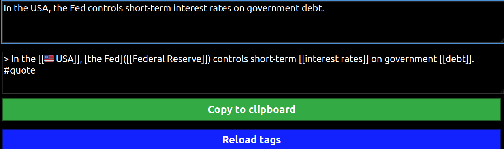

# quote



I often want to pull quotes from papers, the web, etc. and stuff them into [Roam Research][roam], but they have lots of garbage
characters in them, and they don't include my tags. This tool is a simple web app to clean up the input and wrap tags loaded
from a file called `tags.json`. Future iterations may be more intelligent about discovering tags from Roam itself. It will
automatically detect all country names as tags, but **be warned**: I like emojis, so they will be formatted like e.g.
[[:us: USA]].

## `tags.json` format

```json
{
    "TagOne": [        // if "TagOne" is matched directly, wrap it like [[TagOne]]
        "TagOneAlias", // if "TagOneAlias" is matched, wrap it in an alias like [TagOneAlias]([[TagOne]])
    ],
    "TagTwo": [],      // aliases are optional
}
```

## Copyright

Copyright (c) 2023 Charles Neill. All rights reserved. `quote` is distributed under an open-source [BSD licence][license].

[license]: ./LICENSE
[roam]: https://roamresarch.com/
